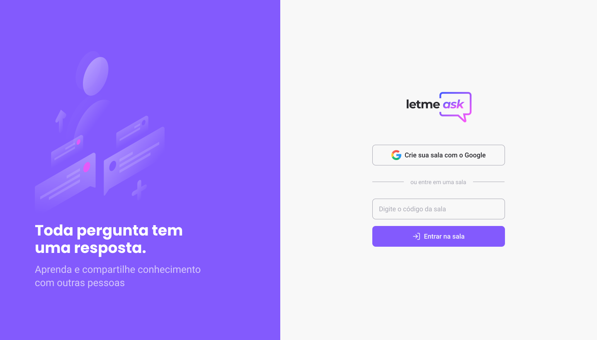

<h1 align="center">
  
</h1>

<p align="center">
    
</p>

<br>

## 🧪 Development

This project was developed using:

- [React](https://reactjs.org)
- [Firebase](https://firebase.google.com/)
- [TypeScript](https://www.typescriptlang.org/)

## 🚀 Running

To start the project, execute the following commands:
```bash
# To install all dependencies
$ yarn

# To start the project
$ yarn start
```
The app will be available on the browser by the access of the address http://localhost:3000.

It'll be necessary to create an account on [Firebase](https://firebase.google.com/) and a project to make Realtime Database available.

## 💻 Project

Letmeask is a perfect project for content creators to establish Q&A rooms to their public, in a very organized and democratic way.

This project was developed on the **[Next Level Week Together](https://nextlevelweek.com/)** event.

## 🔖 Layout

You can visualize the project layout by using the following link:

- [Layout Web](https://www.figma.com/community/file/1009824839797878169/Letmeask)